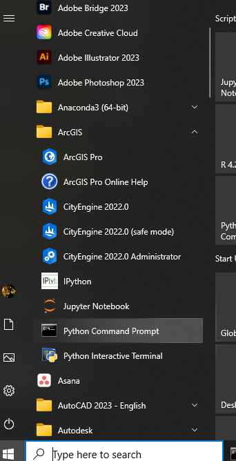
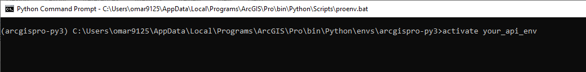
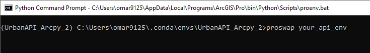
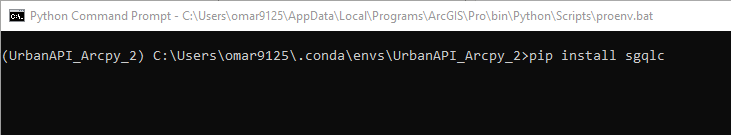
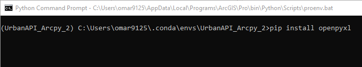
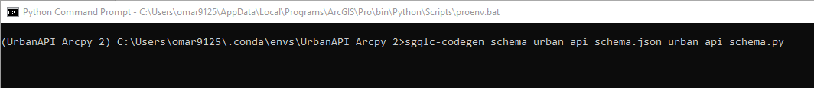
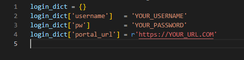
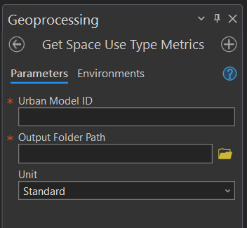

# Urban API -- Getting Started Guide 

## Setting up your environment to utilize the Urban API: Step 1

The following steps will help create a new Python environment where the
Urban API can operate successfully. This new Python environment will
only need to be created once. Specific libraries may need to be updated
occasionally, but repeating the steps in certain sections will help to
update these libraries or schemas.

### Cloning a current ArcGIS Pro Python Environment

Best practices indicate that no Python libraries be installed into the
main ArcGIS Pro Python Environment. Doing so may create inconsistencies
within the libraries and create issues for ArcGIS Pro. Thus, we
recommend cloning the environment so that can be kept separate from the
main ArcGIS Pro Python environment for testing or working with the Urban
API.

1.  Open the python environment by going ArcGIS Folder under your
    Windows Start Button:

    a.  

2.  Once this environment is opened, input the following command in the
    command line:

    a.  [conda create \--clone arcgispro-py3 -n your_api_env]{.mark}

> Note that this new environment can be called any name, in this case it
> will be named 'your_api_env'.
>
> ![Clone Environment]images/image2.png)

3.  Next, activate the environment by typing the following:

[activate your_api_env]{.mark}



4.  We will now swap to your newly created environment.

[proswap your_api_env]{.mark}

> 

5.  This new environment may now be cloned and activated. Next, the
    required libraries will be installed.

### Downloading Necessary Python Libraries 

Next, the following downloading specific libraries for the Urban API,
these include SGQLC & OpenPyxl

1.  Using the same window that you have open from the previous steps,
    include the following command:

[pip install sgqlc]{.mark}



2.  Next, download the next needed library for OpenPyxl, in the command
    line input the following line, the downloading may take a few
    minutes:

[pip install openpyxl]{.mark}



3.  After both have downloaded, ensuring that both have successfully
    been installed is simple to do:

    a.  In the command window, type:

        i.  [python]{.mark}

    b.  Next, both libraries will be called to ensure they are
        accessible:

        i.  [import sgqlc]{.mark}

        ii. [import]{.mark} [openpyxl]{.mark}

    c.  If no errors arise, the python window may be closed by typing:

        i.  [exit()]{.mark}

    d.  If errors do arise, follow steps 1 and 2 in this section again
        to ensure that the correct libraries have been downloaded.

### Downloading API Schema (if not included, or outdated) 

Next the Urban API schema will be downloaded. This schema allows SGQLC
to create the queries that Urban API requires.

1.  This next step will download the urban_api_schema.py into the folder
    that is currently the active directory, this may be changed with the
    following command:

    a.  [cd c:\\your_folder_path_here]{.mark}

    b.  Now the new folder path is set, and anything downloaded will
        come from this folder. This will be useful when we open Jupyter
        notebooks.

2.  Write the following command when opening Python command window:

    a.  [sgqlc -codegen schema urban_api_schema.json
        urban_api_schema.py]{.mark}y



3.  Check the folder path and ensure that the urban_api_schema.py was
    successfully downloaded. A file in the URL that was changed to in
    the previous steps should be visible.

### Setting up Folder Structure

Next, we will create the folder structure to ensure that the necessary
files are in the correct locations. Follow these steps to ensure that
the folder structure is accurate.

1.  Required files will include:

    a.  config.py \*

    b.  urban_api_schema.py

    c.  utils.py \*

\* Indicates that these files com included with the download.

2.  Jupyter Notebooks

    a.  Get Use Type Metrics
    b.  Update Use Type Metrics

3.  How to fill out the config.py file:

    a.  The config file will hold the username, password, and org URL so
        that they don't have to be input openly into the Jupyter
        Notebook itself.

    b.  The config.py file should look like this:



## Setting Up Environment Before Utilizing Notebook: Step 2

### Opening Python Command

Open the Python command window so that these environments may be
switched. Normally, opening the Python command prompt will, by default,
be in the ArcGIS Pro environment. Opening this window is the same as the
step above, in Step 1.

1.  Open you python environment by going to your ArcGIS Folder under
    your Windows Start Button

    a.  

### Switching Environment 

Switch the active environment to access the recently created/cloned
Urban API environment. The environment will need to change it by using a
similar command to the one above. This may need to done again if the
previous session has already been closed.

1.  Activate the environment with the following command:

    a.  [proswap your_api_env]{.mark}

> 

2.  The environment has now been activated and switched to the recently
    created Python environment for the Urban API.

### Switching to Active Folder

Switch to the folder that was created and structured in the previous
section.

1.  After starting the Python Command Prompt, the following command bay
    be used to switch the directory to the current working Urban API
    folder (i.e. wherever all the required files were located)

    a.  [cd c:\\your_folder_path_here]{.mark}

2.  The directories have now been changed.

### Starting Jupyter Notebook

Start the Jupyter Notebook by calling it from the command line.

1.  Since the current directory is where your Jupyter notebooks reside,
    the Jupyter Notebook may be called by using the following command:

    a.  [jupyter notebook]{.mark}

2.  From this page any Jupyter Notebook for Urban API workflows may be
    opened.

## Utilizing Urban API Notebooks and ArcGIS Pro Tools: Step 3 

### Jupyter Notebook

The Urban API may be used to download or update Space Use Metrics
following the following steps.

1.  Ensure that the Jupyter notebooks are in the same folder as the
    utils.py file and the config.py files.

2.  Once your Jupyter Notebook opens (following steps in the previous
    step), you should see the following:

    a.  Urban API - Update Use Type Metrics

    b.  Urban API - Get Use Type Metrics

3.  Once your Jupyter opens, please open the following two notebooks:

    a.  

4.  Open the Get Use Type Metrics and the Update Use Type Metrics
    notebook and begin running each cell.

5.  Take particular note of inputting the required ID's in each cell,
    including the Urban Model ID and the Urban Database ID

    a.  

    b.  In this case, ensure that your Urban Model ID is updated
        correctly before running the cell.

    c.  The folder_path should also be updated correctly, this set
        output excel sheets will be saved.

6.  For the Update Use Type Zones, ensure you have the proper Urban
    Database ID, see below...

    a.  

    b.  Ensure that you run each cell.

### Utilizing ArcGIS Pro Tools 

ArcGIS Pro Tool may also be used to achieve the same results. These
tools will allow for the downloading of the Use Type metrics in a simple
readable Excel sheet. It may also be to update them.

1.  The ArcGIS Pro Tool will have the following tools: Get Zone Type
    Metrics and Update Zone Type Metrics

    a.  {width="3.1086023622047243in"
        height="1.2917782152230972in"}

2.  The Get Zone Type Metrics tool will have the following inputs
    required to run:

    a.  Urban Model ID

    b.  Output Folder Path

    c.  Select a Unit Type (Metric, Standard

    d.  {width="3.0002602799650044in"
        height="2.770126859142607in"}

    e.  Run the tool, and review output Excel file.

    f.  Update desired metrics and run the Update Zone Type Metrics
        tool. (NOTE: Please review Step 4 for updating metric Excel
        sheets).

3.  The Update Zone Type Metrics requires the following inputs:

    a.  Urban Database ID

    b.  Excel file path with updated metrics Excel sheet.

    c.  Unit type selection (metric, standard)

    d.  {width="3.0085936132983377in"
        height="2.6516415135608047in"}

    e.  Run the tool.

    f.  You may now check the

## Updating the Excel Sheet: Step 4

We will review how to use the Excel sheet that gets downloaded, how to
read it, how to update it, and how to utilize it to update the Use Type
Metrics.

The output Excel sheet will have the following information:

-   The name of the plan for those Use Types

-   The Space Use Type Name

-   The Label of the Space Use Type

-   The Custom label of the Space Use Type

-   The number of metrics for each Space Use Type

-   The Global ID of the Space Use Type

-   The Source/Weight Label of the Metric

-   The Metric Global ID

-   The Value of the Metric

-   The Unit Type (number, volume, energy, etc.)

{width="6.5in" height="1.9455544619422571in"}

Each Metric will have the following attributes:

Global ID, Source Weight Label, Metric Global ID, Value, the Unit Type,
the Metric Source ID. These numbers may be empty if that specific Use
Type does not have many metrics.

{width="6.779434601924759in"
height="0.30833333333333335in"}

When updating the Excel sheet, you will need to do the following steps.

1.  Delete the Use Types (i.e. rows in the Excel sheet) that will NOT be
    updated, as these do not need to be updated.

{width="6.5in"
height="2.441666666666667in"}

a.  NOTE: Leaving a non-updated metric will leave it as is, but the tool
    may take slightly longer to run.

b.  For each row (i.e. Use Type), update any metric that needs to be
    updated across the row. If a specific metric will not be updated,
    they can be left as is.

c.  NOTE: No columns may be deleted or removed from the sheet, this may
    cause existing metrics that will not be updated to be removed or
    deleted.

```{=html}
<!-- -->
```
2.  A new version of the Excel sheet should be saved for each of plan,
    after deleting each of the tabs that do not pertain to the plan that
    is currently being updated. For example, updating the South Boston
    Plan should have an Excel sheet that has only that tab and no other
    plans with their updated metrics. Only one tab per sheet may be used
    to update. {width="6.5in"
    height="1.2770581802274716in"}

3.  Update the Value tab for each Use Type metric that needs to be
    updated. If a specific metric does not need to be updated, it may be
    left as in.

{width="6.5in" height="0.5213112423447069in"}

4.  Save the Excel sheet. It is now ready to be used the Update Zone
    Type Metrics tool in either the Jupyter Notebook or the ArcGIS Pro
    Tool.
