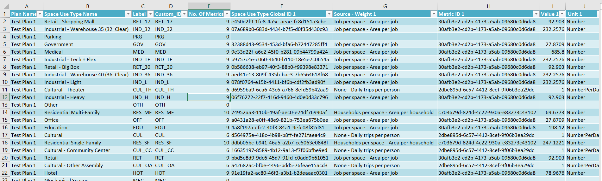

# Urban API Beginning Guide 

## Setting up your environment to utilize the Urban API

You will need to follow these steps to create an environment where the
Urban API can operate. You only need to do this one and your new python
environment will be created. There may times where you must update the
schema or a library, but you may follow the same steps to make sure your
environment is updated.

### Cloning your current Pro Environment

Best practices indicate that you do now install Python libraries into
your ArcGIS Pro Python environment. Doing so may create inconsistencies
within the libraries and create issues for ArcGIS Pro. Thus, we
recommend cloning the environment so that you may keep a separate ArcGIS
Pro Python environment for testing or work such like that with the Urban
API.

1.  Open you python environment by going to your ArcGIS Folder under
    your Windows Start Button

    a.  {width="2.5198129921259844in"
        height="4.921738845144357in"}

2.  Once you open this environment, you will input the following command
    in the command line: [conda create \--clone arcgispro-py3 -n
    your_api_env]{.mark}

> Remember that your environment can be called anything you want, in
> this case we are simply calling it 'your_api_env'.
>
> {width="6.5in" height="0.5770833333333333in"}

3.  Next, we will activate the environment by typing the following:

[activate your_api_env]{.mark}

{width="6.5in" height="0.80625in"}

4.  We will now swap to your newly created environment.

[proswap your_api_env]{.mark}

> {width="6.5in"
> height="0.9458333333333333in"}

5.  Your environment has now been cloned, and active. We will now
    proceed to download the required libraries.

### Downloading Necessary Python Libraries 

Next, we will be downloading specific libraries for the Urban API, these
include SGQLC & OpenPyxl

1.  Using the same window that you have open from the previous steps,
    include the following command:

[pip install sgqlc]{.mark}

{width="6.5in" height="1.2in"}

2.  Next, we will download the next needed library for OpenPyxl, in the
    command line input the following line, the downloading may take a
    few minutes:

[pip install openpyxl]{.mark}

{width="6.5in"
height="1.2173611111111111in"}

3.  After both have downloaded, you can check to ensure that both have
    successfully been installed. Do the following steps:

    a.  In the command window, type:

        i.  [python]{.mark}

    b.  Next, lets call both libraries to ensure they are accessible.
        Type in the following:

        i.  [import sgqlc]{.mark}

        ii. [import]{.mark} [openpyxl]{.mark}

    c.  If no errors arise, simply type the following to exit the python
        window:

        i.  [exit()]{.mark}

### Downloading API Schema (if not included, or outdated) 

Next we will need to download the Urban API schema, the Urban API Schema
allows SGQLC to create the queries that Urban API requires.

1.  This next step will download the urban_api_schema.py into the folder
    where you currently directory is, we change this with the following
    command:

    a.  [cd c:\\your_folder_path_here]{.mark}

    b.  Now your folder path is set, and anything you download (or open)
        will come from this folder. This will be useful when we open
        Jupyter notebooks.

2.  Write the following command in the same Python command window:

    a.  [sgqlc -codegen schema urban_api_schema.json
        urban_api_schema.py]{.mark}y

{width="6.5in" height="0.7145833333333333in"}

3.  Check your folder path and ensure that the urban_api_schema.py was
    successfully downloaded. You should see the file in the URL that you
    changed to in the previous steps.

## Setting up Folder Structure

Next, we will create our folder structure to ensure that the necessary
files are in the right locations. Follow these steps to ensure your
folder structure is accurate.

1.  Required files will include:

    a.  config.py \*

    b.  urban_api_schema.py

    c.  utils.py \*

\* Indicates that these files com included with the download.

2.  Jupyter Notebooks

    a.  Notebook 1

    b.  Notebook 2

    c.  Notebook 3

    d.  

3.  How to fill out the config.py file

    a.  The config file will hold your username, password, and org URL
        so that you don't have to input it openly into the Jupyter
        Notebook itself.

    b.  The config.py file should look like this:

{width="5.228512685914261in"
height="1.2810903324584426in"}

## Setting Up Environment Before Utilizing Notebook 

### Opening Python Command

Open the Python command window so you can switch environments. Normally,
opening the Python command prompt will, by default, be in the ArcGIS Pro
environment. Opening this window is the same as the step above.

1.  Open you python environment by going to your ArcGIS Folder under
    your Windows Start Button

    a.  {width="2.5198129921259844in"
        height="4.921738845144357in"}

### Switching Environment 

Switch your active environment to access the recently created/cloned
Urban API environment. You will need to change it by using a similar
command to the one above. You may need to do this again if you have
already closed out from a previous session.

1.  Activate your environment with the following command:

    a.  [proswap your_api_env]{.mark}

> {width="6.5in"
> height="0.9458333333333333in"}

2.  You have no activated and switched to your recently created Python
    environment for the Urban API.

### Switching to your Folder

Switch to the folder that was created and structured in the previous
section.

1.  After starting the Python Command Prompt, use the following command
    to switch your directory to your working Urban API folder (i.e.
    wherever you located all the required files)

    a.  [cd c:\\your_folder_path_here]{.mark}

2.  You have no changed directories!

### Starting Jupyter Notebook

Start the Jupyter Notebook by calling it from the command line.

1.  Since we are in the directory where your Jupyter notebooks reside,
    you can simply call the Jupyter Notebook by using the following
    command:

    a.  [jupyter notebook]{.mark}

2.  From this page you can open any Jupyter Notebook for Urban API
    workflows.

## Utilizing Urban API Notebooks 

You may use the Urban API to update your get and update your Space Use
Metrics following the following steps.

1.  Ensure that the Jupyter notebooks are in the same folder as the
    utils.py file and the config.py file.

2.  Once your Jupyter Notebook opens (following steps in the previous
    step), you should see the following:

    a.  Urban API - Update Use Type Metrics

    b.  Urban API Get Use Type Metrics

3.  Once your Jupyter opens, please open the following two notebooks:

    a.  {width="5.391666666666667in"
        height="0.8499715660542432in"}

4.  Open the Get Use Type Metrics and the Update Use Type Metrics
    notebook and begin running each cell.

5.  Take particular note of inputting the require ID's in each cell

    a.  {width="6.5in"
        height="0.5861111111111111in"}

    b.  In this case, make sure that your Urban Model ID is updated
        correctly before running the cell

    c.  The folder_path should also be updated correctly, this set where
        your output excel sheets will be saved

6.  For the Update Use Type Zones, ensure you have the proper Urban
    Model ID and Urban Database ID, see below...

    a.  {width="5.158333333333333in"
        height="1.4031102362204724in"}

    b.  Run each cell and get and update the Use Type ID's.

## Utilizing ArcGIS Pro Tools 

You may also an ArcGIS Pro Tool to achieve the same results, downloading
your Use Type metrics, as well as updating them.

1.  The ArcGIS Pro Tool will have to tools within it, similar to the
    Jupyter Notebook, there are Get Zone Type Metrics and Update Zone
    Type Metrics

    a.  {width="3.1086023622047243in"
        height="1.2917782152230972in"}

2.  The Get Zone Type Metrics tool will have the following inputs
    required to run

    a.  Urban Model ID

    b.  Output Folder Path

    c.  Select a Unit Type (Metric, Standard)

    d.  Configuration File (Optional)

    e.  {width="3.0002602799650044in"
        height="3.6586504811898513in"}

    f.  Run the tool, and review output excel file.

    g.  Update desired metrics and run the Update Zone Type Metrics
        tool.

3.  The Update Zone Type Metrics requires the following inputs:

    a.  Urban Database ID

    b.  Excel file path with updated metrics

    c.  Unit type selection (metric, standard)

    d.  {width="3.0085936132983377in"
        height="3.8253313648293963in"}

    e.  Run the tool.

## Updating the Excel Sheet

We will review how to use the Excel sheet that gets downloaded, how to
read it, how to updated it, and how to utilize it to update the Use Type
Metrics.

The output Excel sheet will have the following information:

-   The Name of the plan

-   The Space Use Type Name

-   The Label of the Space Use Type

-   The Custom label of the Space Use Type

-   The amount of metrics for each Space Use Type

-   The Global ID of the Space Use Type

-   The Source/Weight Label of the Metric

-   The Metric Global ID

-   The Value of the Metric

-   The Unit Type (number, volume, energy, etc)

{width="6.5in"
height="1.9618055555555556in"}

Each Metric will have the following tabs:

Global ID, the Source Weight Label, Metric Global ID, Value, the Unit
Type, the Metric Source ID. Ensure to check these closely.

{width="6.5in"
height="2.377083333333333in"}

When updating the excel sheet, you will need to do the following steps.

1.  Delete all of the Use Types that you DO NOT want to update, you
    don't need to include them.

    a.  NOTE: If you leave these included nothing will happen to that
        metric, but the tool may take slightly longer.

2.  Save a new version of the Excel sheet for each of your plans, and
    delete each of the tabs that do not pertain to the plan that you are
    currently updating. For example, in the sample below, you should
    have something like South_Boston_Update.xslx, Test_Plan_Update.xslx,
    Western_Avenue_Update.xlsx, to update each metric in each plan.

{width="6.5in"
height="3.040277777777778in"}

3.  Update the Value tab for each Use Type metric you want to update. If
    you don't need to update a specific metric, simply leave it alone.

{width="6.5in" height="2.377083333333333in"}

4.  Save the Excel sheet. It is now ready to be used the Update Zone
    Type Metrics tool in either the Jupyter Notebook or the ArcGIS Pro
    Tool.
